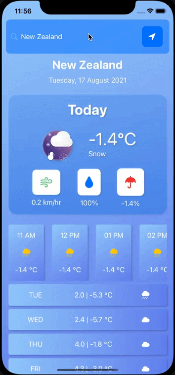
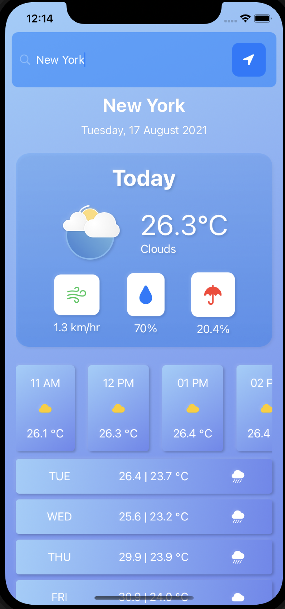
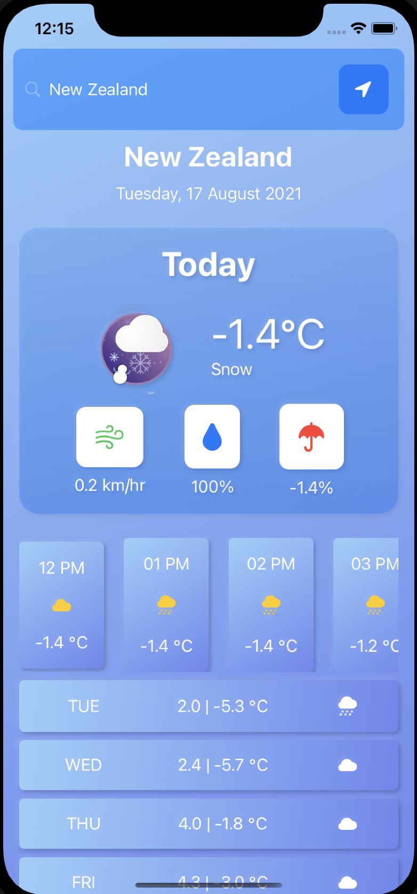

# Paolinsky Weather app

Weather app made using swiftUI, Lottie animations and the openweather api (https://openweathermap.org/api/one-call-api)

## Setup
- Get your own api key for openweather api [here](https://openweathermap.org/api) (Select one call api)

- Go to ./WeatherApp/Networking and rename Api.example.swift to Api.swift, and put your api key in there.

- Add the lottie dependency (https://github.com/airbnb/lottie-ios.git) into Xcode

## Screenshots

